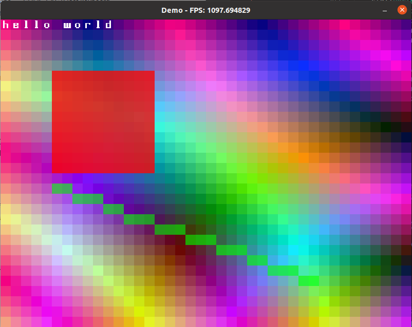

# RCEngine
## Description
Rainstorm Console Engine

A simple console engine based on SDL2.
## Demo

## License
The MIT License (MIT)

Copyright (c) 2020 Daniel Hongyu Ding

Permission is hereby granted, free of charge, to any person obtaining a copy of this software and associated documentation files (the "Software"), to deal in the Software without restriction, including without limitation the rights to use, copy, modify, merge, publish, distribute, sublicense, and/or sell copies of the Software, and to permit persons to whom the Software is furnished to do so, subject to the following conditions:

The above copyright notice and this permission notice shall be included in all copies or substantial portions of the Software.

THE SOFTWARE IS PROVIDED "AS IS", WITHOUT WARRANTY OF ANY KIND, EXPRESS OR IMPLIED, INCLUDING BUT NOT LIMITED TO THE WARRANTIES OF MERCHANTABILITY, FITNESS FOR A PARTICULAR PURPOSE AND NONINFRINGEMENT. IN NO EVENT SHALL THE AUTHORS OR COPYRIGHT HOLDERS BE LIABLE FOR ANY CLAIM, DAMAGES OR OTHER LIABILITY, WHETHER IN AN ACTION OF CONTRACT, TORT OR OTHERWISE, ARISING FROM, OUT OF OR IN CONNECTION WITH THE SOFTWARE OR THE USE OR OTHER DEALINGS IN THE SOFTWARE.

This file can be found at https://github.com/rainstormstudio/RCEngine
Some concepts are based on the olcConsoleGameEngine.h by OneLoneCoder

## Usage
```
class Demo : public RCEngine {
    ...

public:
    Demo() {
        windowTitle = "title of the window";
    }

    bool start() override {
        ...
        return true;
    }

    bool update(double deltaTime) override {
        ...
        return true;
    }

    bool render(double deltaTime) override {
        ...
        return true;
    }

    // and optional destroy
    bool destroy() override {
        ...
        return true;
    }
};

int main() {
    Demo demo;
    if (demo.createConsole()) {
        demo.init();
    }

    return 0;
}
```

Note that keyboard and mouse events are supported

The tileset of this engine must be included, and the default one
is RCE_tileset.png, which can also be found at 
https://github.com/rainstormstudio/RCEngine

## build
```
g++ -g ./*.cpp -o demo -lSDL2 -lSDL2_image -lSDL2_ttf -lSDL2_mixer
```
## Author
Daniel Hongyu Ding